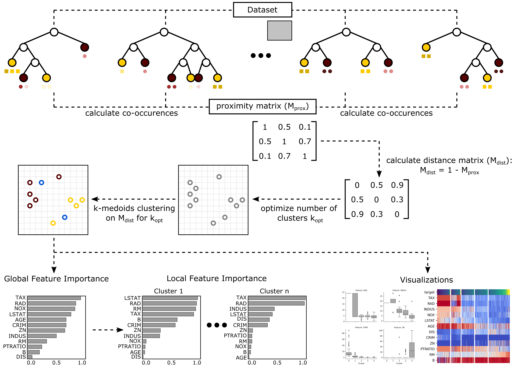

|Stars| |PyPI| |Docs| |Cite|

.. |Stars| image:: https://img.shields.io/github/stars/HelmholtzAI-Consultants-Munich/forest_guided_clustering?logo=GitHub&color=yellow
   :target: https://github.com/HelmholtzAI-Consultants-Munich/forest_guided_clustering/stargazers
.. |PyPI| image:: https://img.shields.io/pypi/v/fgclustering.svg
   :target: https://pypi.org/project/fgclustering
.. |Docs| image:: https://readthedocs.org/projects/forest-guided-clustering/badge/?version=latest
   :target: https://forest-guided-clustering.readthedocs.io
.. |Cite| image:: https://zenodo.org/badge/397931780.svg
   :target: https://zenodo.org/badge/latestdoi/397931780

Forest-Guided Clustering - Explainability for Random Forest Models
=========================================================================

This python package is about explainability of Random Forest models. Standard explainability methods (e.g. feature importance) assume independence of model features and hence, are not suited in the presence of correlated features. The Forest-Guided Clustering algorithm does not assume independence of model features, because it computes the feature importance based on subgroups of instances that follow similar decision rules within the Random Forest model. Hence, this method is well suited for cases with high correlation among model features.

For detailed documentation and usage examples, please visit the `Read the Docs documentation <https://forest-guided-clustering.readthedocs.io/>`_. If Forest-Guided Clustering is useful for your research, consider citing with https://zenodo.org/badge/latestdoi/397931780 .

Installation
-------------------------------

**Requirements:**

- >= Python 3.8 
- :code:`pandas`, :code:`numpy`, :code:`tqdm`
- :code:`sklearn`, :code:`scikit-learn-extra`, :code:`scipy`, :code:`statsmodels`
- :code:`matplotlib`, :code:`seaborn`

All required packages are automatically installed if installation is done via :code:`pip`.

**Install Options:**

PyPI install:

.. code:: bash

    pip install fgclustering

Usage
-------------------------------

To get explainability of your Random Forest model via Forest-Guided Clustering, you simply need to run the following commands:

.. code:: python

   from fgclustering import FgClustering
   
   # initialize and run fgclustering object
   fgc = FgClustering(model=rf, data=data_boston, target_column='target')
   fgc.run()
   
   # visualize results
   fgc.plot_global_feature_importance()
   fgc.plot_local_feature_importance()
   fgc.plot_heatmap()
   fgc.plot_boxplots()
   
   # obtain optimal number of clusters and vector that contains the cluster label of each data point
   optimal_number_of_clusters = fgc.k
   cluster_labels = fgc.cluster_labels

where 

- :code:`model=rf` is a Random Forest Classifier or Regressor object,
- :code:`data=data_boston` is the dataset on which the Random Forest model was trained on, e.g. boston housing dataset, and
- :code:`target_column='target'` is the name of the target column (i.e. *target*) in the provided dataset. 

For a detailed tutorial see the IPython Notebook :code:`tutorial.ipynb`.

License
-------------------------------

The fgclustering package is MIT licensed.

Contributing
-------------------------------

Contributions are more than welcome! Everything from code to notebooks to examples and documentation are all equally valuable so please don't feel you can't contribute. To contribute please fork the project make your changes and submit a pull request. We will do our best to work through any issues with you and get your code merged into the main branch.
