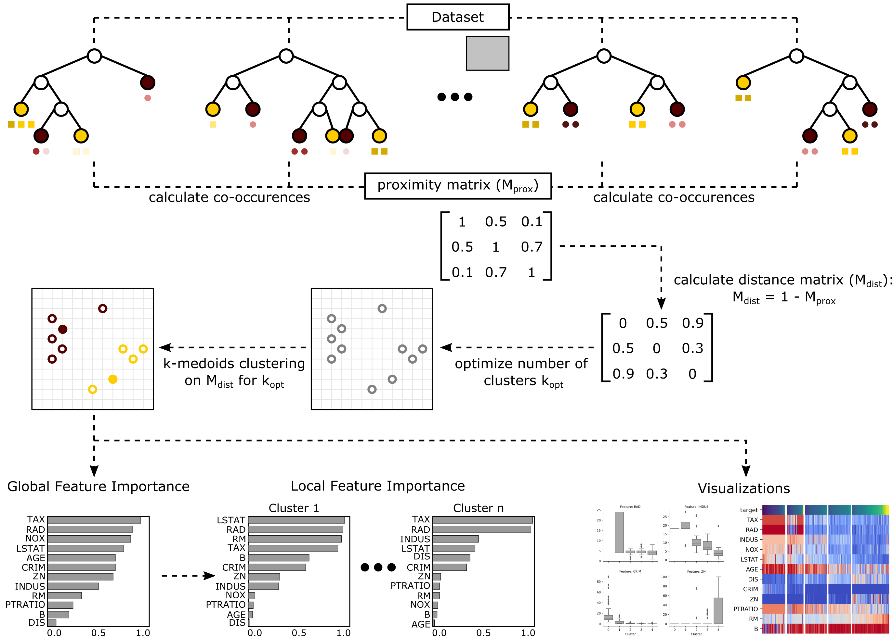

.. Forest Guided Clustering documentation master file, created by
   sphinx-quickstart on Thu Dec  9 16:39:21 2021.
   You can adapt this file completely to your liking, but it should at least
   contain the root `toctree` directive.

Forest-Guided Clustering - Explainability for Random Forest Models
=========================================================================

This python package is about explainability of Random Forest models. Standard explainability methods (e.g. feature importance) assume independence of model features and hence, are not suited in the presence of correlated features. The Forest-Guided Clustering algorithm does not assume independence of model features, because it computes the feature importance based on subgroups of instances that follow similar decision rules within the Random Forest model. Hence, this method is well suited for cases with high correlation among model features.

**Citation:** If Forest-Guided Clustering is useful for your research, consider citing the package via `DOI: 10.5281/zenodo.6445529 <https://zenodo.org/badge/latestdoi/397931780>`_.

Quick Start
==================

**Installation:**

.. code:: bash

    pip install fgclustering

**Basic Usage:**

To get explainability of your Random Forest model via Forest-Guided Clustering, you simply need to run the following commands:

.. code:: python

   from fgclustering import FgClustering
   
   # initialize and run fgclustering object
   fgc = FgClustering(model=rf, data=data_boston, target_column='target')
   fgc.run()
   
   # visualize results
   fgc.plot_global_feature_importance()
   fgc.plot_local_feature_importance()
   fgc.plot_decision_paths()
   
   # obtain optimal number of clusters and vector that contains the cluster label of each data point
   optimal_number_of_clusters = fgc.k
   cluster_labels = fgc.cluster_labels

where 

- :code:`model=rf` is a Random Forest Classifier or Regressor object,
- :code:`data=data_boston` is the dataset on which the Random Forest model was trained on, e.g. boston housing dataset, and
- :code:`target_column='target'` is the name of the target column (i.e. *target*) in the provided dataset. 

For a detailed tutorial see the IPython Notebook :code:`tutorial.ipynb` or Forest-Guided Clustering Tutorial.

Table of Content
==================

.. toctree::
   :maxdepth: 2
   
   introduction
   general_algorithm
   feature_importance
   tutorial

**API Reference:**

.. toctree::
   :maxdepth: 1
   
   modules

Indices and tables
==================

* :ref:`genindex`
* :ref:`modindex`
* :ref:`search`
