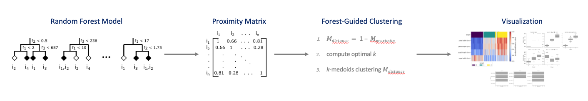

.. Forest Guided Clustering documentation master file, created by
   sphinx-quickstart on Thu Dec  9 16:39:21 2021.
   You can adapt this file completely to your liking, but it should at least
   contain the root `toctree` directive.

Forest-Guided Clustering - Explainability for Random Forest Models
=========================================================================

This python package is about explainability of Random Forest models. Standard explainability methods (e.g. feature importance) assume independence of model features and hence, are not suited in the presence of correlated features. The Forest-Guided Clustering algorithm does not assume independence of model features, because it computes the feature importance based on subgroups of instances that follow similar decision rules within the Random Forest model. Hence, this method is well suited for cases with high correlation among model features.

**Installation:**

PyPI install:

.. code:: bash

    pip install fgclustering
    
.. toctree::
   :maxdepth: 2
   :caption: User Guide / Tutorial:

   basicusage
   tutorial

.. toctree::
   :maxdepth: 2
   :caption: Theoretical Background:
   
   introduction
   general_algorithm
   feature_importance

.. toctree::
   :maxdepth: 2
   :caption: API Reference:
   
   modules

Indices and tables
==================

* :ref:`genindex`
* :ref:`modindex`
* :ref:`search`
