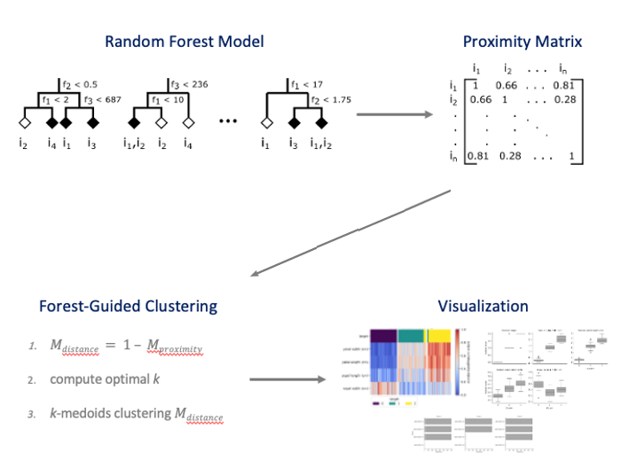

Introduction
===============

Explainable AI
--------------
Complex supervised ML models are often considered to be “Black Boxes” because it can be hard to understand why certain predictions have been made by the
model. It means that although the model correctly predicts the outcome of an observation, we cannot explain the logic behind those predictions. But why aren’t
we just satisfied with an accurately predicting model?

*"The problem is that a single metric, such as classification accuracy, is an incomplete description of most real-world tasks."
— (Doshi-Velez et al., 2017)*

Particularly in biology, it is more and more important to not just accurately predict
the outcome of a biological system with a ML model but also be able to uncover the
mechanisms behind those biological systems that led to a certain outcome. To
uncover the underlying mechanisms of a biological system, we have to work on the
interpretability of our ML models, which are able to learn the underlying patterns in
our data. Interpretability means, for example, to understand which features play
the most important role in predicting the outcome of an observation or which
combination of features lead to a certain outcome.

Forest guided clustering
------------------------
Explainability methods like variable importance pinpoint the individual contribution of each feature to the classification or regression problem, but cannot
identify the role of correlated features and of feature combinations.

An example would be a dataset where sex and alcohol as well as tobacco consumption are predictors for a specific disease. 
In this imaginary dataset alcohol consumption for woman alcohol consume is a high risk factor, while for men alcohol is not a risk factor while tobacco consumption is. In this case the feature importance of alcohol and tobacco consumption is different for different sub sets of the data (men and women). This could however not be uncovered by standard feature importance metrics that asign a single importance score to each feature.

Forest-guided clustering allows to find and understand these kinds of pattern buy grouping the data into subgroups that follow similar decision rules in the random forest model that was trained on the data.
It works by defining a similarity metric on the data points based on the Random forest proximity matrix that indicates which data instances follow the same decision rules. Based on this similarity a k-medioids clustering is used to find subgroups of the dataset. For each of these subgroups, that follow similar decision paths in the random forest, the importance of the different features can be analysed separately.

In the above example the forest guided clustering would separate men and women into different subgroups, not because sex is a predictor of the disease but because for men and women the random forest would look at different features in order to determine the risk.
The grouping of the dataset using forest guided clustering is thus more fine grained than just the grouping that is done by the random forest. We do not just categorize the data set in a high and low risk group for the disease but into finder subgroups dependent on which factors are relevant for determining the risk.

